# ErgoWell

ErgoWell is a project meant to be used for investing in ventures trying to raise money through crowdfunding. As an investor, you can search and find projects that are attractive to you, invest in them and receive interests and rewards. As a venture owner, you can raise money for your project through crowdfunding.

## Idioms used

### Venture/Project

In ErgoWell, anyone (a person, organization, etc.) can define a venture which is planned to do something special in a determined period of time (which is called its lifetime). It needs a determined amount of fund to get started. At the end of its lifetime, it may be profitable for the investors or not.

### Investment/Staking/Locking

We use these terms interchangeably in this doc and simply mean putting some money in a venture to fund it and receive interests and rewards in return.

### Interest

It is money that is payed to investors in regular periods to encourage them keep their money in the venture. Unlike reward, it is guaranteed to be payed.

### Collateral

Some ventures may provide some collateral that guarantees if the venture is unsuccessful, this collateral gets distributed to the investors to compensate some or all of their loss. In other words, it is guaranteed to be payed in case of venture failure. It may come in the form of ERGs, normal tokens or NFTs. Please note that this collateral is distributed by ErgoWell manually. It's not an automatic transaction.

### Reward/Profit

Any venture is meant to make profit for its investors. In ErgoWell, this profit, like the collateral, may have different forms. It gets distributed to investors at the end of venture lifetime. Note that unlike interest, this is not guaranteed to be payed.

### Risk

When someone stakes in a venture, supposing it is funded successfully, a part of the fund is given to the venture and is not accessible to investors anymore. It just _may_ be returned at the end of venture lifetime, but not necessarily. So we can say that investors are risking that part of their money in the hope for a reward. They may lose that portion totally and get nothing back, or they may get huge rewards. Please note we also may mention "reducing risk" in parts of this text (which mean unstaking part of your money and putting it somewhere else), but it has nothing to do with the risk we defined before. That risk cannot be _reduced_: You just risk it once, when you invest your money, and it cannot be changed at all.

## ErgoWell: Investor's point of view

Suppose you are an investor, trying to lock your money in a good venture, receiving interests and other rewards. In ErgoWell, you may do something like this:

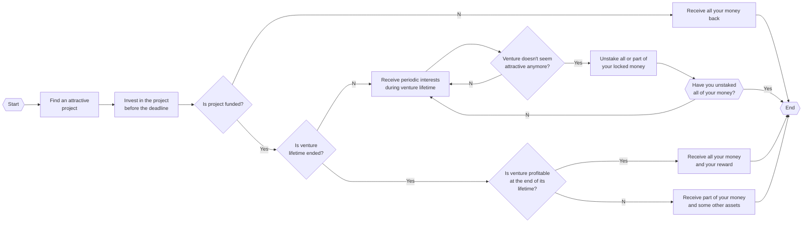

1. You first need to find some ventures that attracts your attention. You probably need to read their whitepaper and see if they have the potential for making any profit, if they provide acceptable interest, and if they provide any collateral to reduce your risk.
2. Once you find a good venture, you need to invest your money in it and wait to see if it gets funded before the deadline. If it's not, you will get back your money.
3. If the project is funded, you may receive some interest in regular periods (each month, for example).
4. While the venture is active, you may notice that it is not what it meant to be. It may underperform, for example, or you may just lose your interest in the venture for no reason. No matter the reason, you may decide not to risk on it anymore. As a result, you may want to get part or all of your money back. Please consider that in some ventures, you can only unstake your money in special periods of venture lifetime (in the first 3 months, for example). In addition, you may be asked to pay some penalty for unstaking. Another thing to spot is that, you probably cannot unstake all your money in most of the projects, based on the venture risk. If the risk is 30%, for example, then you only can unstake 70% of your investments and the other 30% are locked until the end of project lifetime. You need to select your venture carefully based on all these metrics in the first step.
5. At the end of venture lifetime, two things may happen: Either the venture is successful, returning all the risked money of investors and some probable additional rewards. In this case, you get all your money back and a portion of the additional rewards based on how much you invested in the venture.
6. If, on the other hand, the project is not successful, you will get all your money that is not part of the risk. The risked portion, however, is not available anymore and you have lost it. The venture, however, may provide some collateral to be given to investors, compensating part of your loss. It even may be so valuable that be larger than your risked money.

It's obvious that you - as the investor - are responsible for considering all these metrics together and decide what is the best action in any phase of the lifetime of a venture.

## ErgoWell: Venture's point of view

Suppose you are the owner of a venture called AwesomeDAO. You want to raise money (say in SigmaUSD, for example), grow the DAO to make profit and return a part of that profit to the investors. In ErgoWell, your AwesomeDAO will have a lifecycle like this:

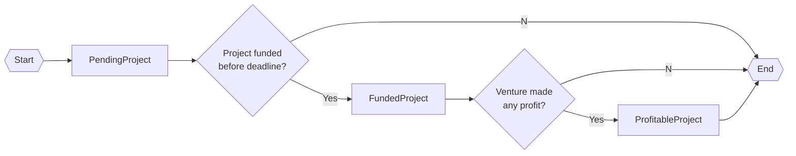

1. You first get a license from ErgoWell service (in the form of a NFT). This license indicates that AwesomeDAO is legitimate and it is safe for investors to put their money in it. In addition:

- You need to pay some ERGs which will be used to pay fees of the on-chain transactions.
- You may provide some interest money which is payed to investors periodically.
- You may provide a collateral, so that you guarantee if AwesomeDAO is failed, the investors get back some of the collateral, hence reducing their risk.
- You need to set some configurations for AwesomeDAO. For example, how much fund do you need, when is the deadline of your funding, how long is your project life time if funded successfully, etc.

2. You need to wait and see if enough fund is raised before the deadline you set. In this phase, investors provide some money in the form you need (which is SigmaUSD for our example) and get some special token in return.
3. If the fund is not raised before the deadline, all the money, either investors' or yours (as venture owner) is returned and the license is redeemed back to ErgoWell.
4. If the fund is raised, a portion of the fund is given to AwesomeDAO and the remaining part is locked until the end of the venture lifetime.
5. While AwesomeDAO is active, the investors receive some interest if you provided some money for paying interests in the first step.
6. When the AwesomeDAO lifetime is ended, it may or may not be profitable. If profitable, you can provide a portion of the profit to investors as a reward. If the project is not profitable, the portion of money that was locked is distributed back to investors. In addition, if you provided some collateral in the first step, it is distributed, too. After the distribution, the license is redeemed.

## Tokens

ErgoWell has the following set of well-defined tokens:

- **ErgoWellTrademarkNFT**: This is a NFT to make the box uniquely accessible and valid in all the blockchain.
- **LicenseNFT**: This NFT is used to mark a venture as legitimate.

In addition, we use the following special token names:

- **Koin**: A specific token which is used as base staking currency.
- **Stakoin** (/steɪkɔɪn/, like _"stay coin"_): A token which has the same theoretical value as a Koin token. It is an indicator showing that someone has staked in a specific venture.
- **InterestToken**: A token used as base currency for paying interests.

## Boxes

_Note: You can skip this section if you are not interested in technical details of ErgoWell._

### ProjectFactory

This box is used to provide and redeem licenses. It also contains some data about the service.

| Token                | Count                                   |
| -------------------- | --------------------------------------- |
| ErgoWellTrademarkNFT | `1`                                     |
| LicenseNFT           | `n` (total number of possible projects) |

| Register | Type         | Content                |
| -------- | ------------ | ---------------------- |
| R4       | `Coll[Byte]` | `serviceAddress`       |
|          |              |                        |
| R5       | `Int`        | `serviceFee` (percent) |

### TokenlessPendingProject

This is a temporary box which will be merged with StakoinBank.
| Token | Count | Usage |
| ------------- | ----- | ----- |
| LicenseNFT | `1` | - |
| InterestToken | `m` | - |

| Register | Type         | Content                          |
| -------- | ------------ | -------------------------------- |
| R4(0)    | `Coll[Byte]` | `koinTokenId`                    |
| R4(1)    | `Coll[Byte]` | `stakoinTokenId`                 |
| R4(2)    | `Coll[Byte]` | `ventureAddress`                 |
| R4(3)    | `Coll[Byte]` | `serviceAddress`                 |
|          |              |                                  |
| R5(0)    | `Int`        | `fundingDeadline` (height)       |
| R5(1)    | `Int`        | `distributionInterval` (blocks)  |
| R5(2)    | `Int`        | `lifetime` (blocks)              |
| R5(3)    | `Int`        | `risk` (percent)                 |
| R5(4)    | `Int`        | `serviceFee`                     |
| R5(5)    | `Int`        | `unstakingPenalty` (percent)     |
| R5(6)    | `Int`        | `profitFillingDeadline` (height) |
| R5(7)    | `Int`        | `allowedUnstakingMinHeight`      |
| R5(8)    | `Int`        | `allowedUnstakingMaxHeight`      |
|          |              |                                  |
| R6       | `Long`       | `hitThreshold` (in Stakoins)     |

### StakoinBank

This is a temporary box which will be merged with TokenlessPendingProject.
| Token | Count |
| ------- | -------------------- |
| Stakoin | `aLargeEnoughNumber` |

| Register | Type         | Content        |
| -------- | ------------ | -------------- |
| R4       | `Coll[Byte]` | `licenseNFTId` |

### Collateral

This box is used as a guarantee for investors and a way of reducing investors risk. It will be distributed to investors in case of a failed project. Please note that this box can contain anything: ERGs, NFTs, etc.

| Token   | Count |
| ------- | ----- |
| Stakoin | `1`   |

### PendingProject

This is a box containing all the funds before the project deadline. It may or may not hit the funding threshold before the funding deadline.
| Token | Count |
| ------------- | -------------------- |
| LicenseNFT | `1` |
| InterestToken | `x` |
| Koin | initially `0` |
| Stakoin | `aLargeEnoughNumber` |

| Register | Type         | Content                     |
| -------- | ------------ | --------------------------- |
| R4(0)    | `Coll[Byte]` | `koinTokenId`               |
| R4(1)    | `Coll[Byte]` | `ventureAddress`            |
| R4(2)    | `Coll[Byte]` | `serviceAddress`            |
|          |              |                             |
| R5(0)    | `Int`        | `fundingDeadline`           |
| R5(1)    | `Int`        | `distributionInterval`      |
| R5(2)    | `Int`        | `lifetime`                  |
| R5(3)    | `Int`        | `risk`                      |
| R5(4)    | `Int`        | `serviceFee`                |
| R5(5)    | `Int`        | `unstakingPenalty`          |
| R5(6)    | `Int`        | `profitFillingDeadline`     |
| R5(7)    | `Int`        | `allowedUnstakingMinHeight` |
| R5(8)    | `Int`        | `allowedUnstakingMaxHeight` |
|          |              |                             |
| R6(0)    | `Long`       | `lockedKoinsCount`          |
| R6(1)    | `Long`       | `hitThreshold`              |

### FundedProject

If a PendingProject is funded, this box gets created with most of the contents of PendingProject box.
| Token | Count |
| ------------- | ---------------------------------------------------------------- |
| LicenseNFT | `1` |
| Koin | initially `hitThreshold + 1 - venture fund` |
| Stakoin | `totalPeriodsNumber` |
| InterestToken | initially `aLargeEnoughNumber - serviceFee` (still large enough) |

| Register | Type         | Content                     |
| -------- | ------------ | --------------------------- |
| R4       | `Coll[Byte]` | `ventureAddress`            |
|          |              |                             |
| R5(0)    | `Int`        | `distributionInterval`      |
| R5(1)    | `Int`        | `lifetime`                  |
| R5(2)    | `Int`        | `risk`                      |
| R5(3)    | `Int`        | `lastPaymentPeriodNumber`   |
| R5(4)    | `Int`        | `unstakingPenalty`          |
| R5(5)    | `Int`        | `profitFillingDeadline`     |
| R5(6)    | `Int`        | `allowedUnstakingMinHeight` |
| R5(7)    | `Int`        | `allowedUnstakingMaxHeight` |
|          |              |                             |
| R6(0)    | `Long`       | `hitThreshold`              |
| R6(1)    | `Long`       | `lockedKoinsCount`          |

### PeriodInterestBank

In each period, one of this box is created and is used to distribute interest to investors.
| Token | Count |
| ------------- | ----- |
| InterestToken | `m` |
| Stakoin | `1` |

| Register | Type  | Content                      |
| -------- | ----- | ---------------------------- |
| R4       | `Int` | `currentPaymentPeriodNumber` |

### ProfitableProject

When the project ends, this box is created from FundedProject. It may contain some profit for investors, but not necessarily.
| Token | Count |
| ---------- | ------------------------------------------- |
| LicenseNFT | `1` |
| Koin | initially `hitThreshold + 1 - venture fund` |
| Stakoin | `totalPeriodsNumber` |

| Register | Type         | Content                   |
| -------- | ------------ | ------------------------- |
| R4       | `Coll[Byte]` | `ventureAddress`          |
|          |              |                           |
| R5(0)    | `Int`        | `risk`                    |
| R5(1)    | `Int`        | `lastPaymentPeriodNumber` |
| R5(2)    | `Int`        | `profitFillingDeadline`   |
|          |              |                           |
| R6(0)    | `Long`       | `hitThreshold`            |
| R6(1)    | `Long`       | `lockedKoinsCount`        |
|          |              |                           |
| R7       | `Short`      | `isVentureSuccessful`     |

### Payment

This indicates any type of payment (ERGs or tokens).

### Ticket

When someone invests in the venture, he/she gets back a ticket indicating the investment of some money.
| Token | Count |
| ------- | ----- |
| Stakoin | `x` |

| Register | Type         | Content                   |
| -------- | ------------ | ------------------------- |
| R4       | `Coll[Byte]` | `ownerPublicKey`          |
| R5       | `Int`        | `lastPaymentPeriodNumber` |

## Transactions diagrams

_Note: You can skip this section if you are not interested in technical details of ErgoWell._

### Project creation

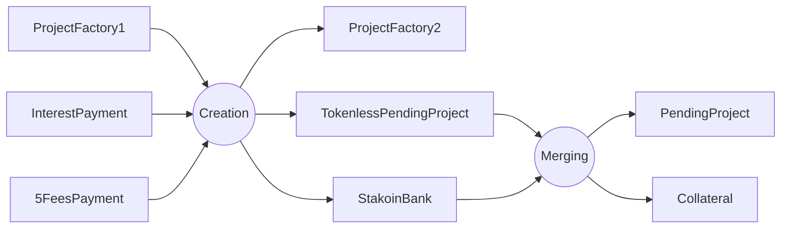

Changes:

- ProjectFactory: One of the licenses is used.

You may wonder why we don't create `PendingProject` box as a result of `Creation` transaction. When `StakoinBank` is created, it's registers are full and we cannot use them, but we need to keep some configurations for the project. So we cannot create `PendingProject` in one step, as we don't have enough empty registers.

### Collateral charging

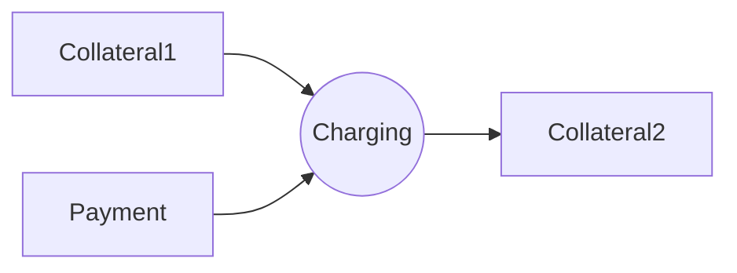

Changes:

- Collateral: Some NFTs, ERGs, etc. are added to the box.

Note that this box can be charged any time in the lifetime of the venture, not only when it is created. For example, a venture may provide no collateral at first, but provide some later to answer an impulsive unstaking done by investors. Also consider that charging of collateral cannot be undone.

### Crowdfunding

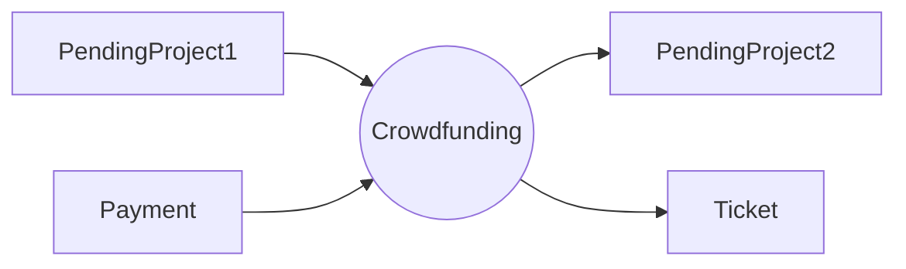

Changes:

- PendingProject: Some Koins are traded for the same number of Stakoins;

### Project owner refunding

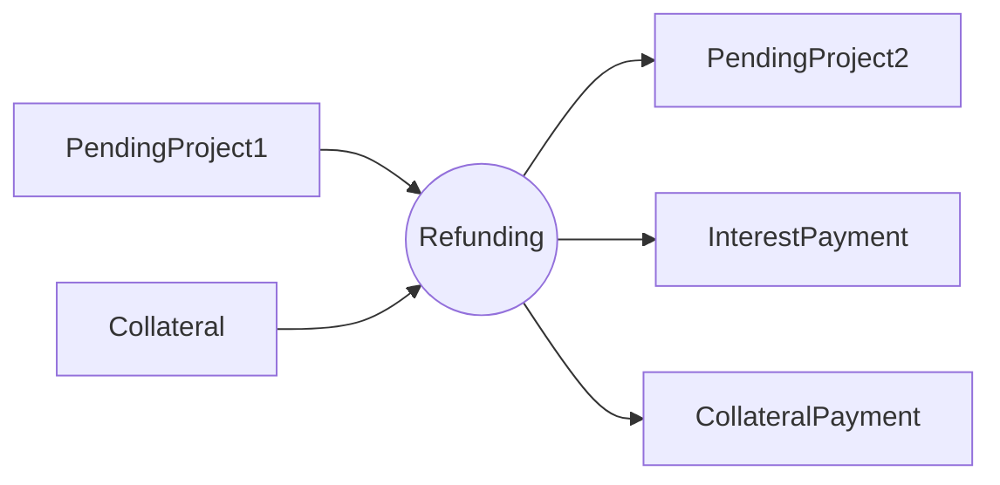

Changes:

- PendingProject: Interest bank is removed from the box.

### Stakeholder refunding

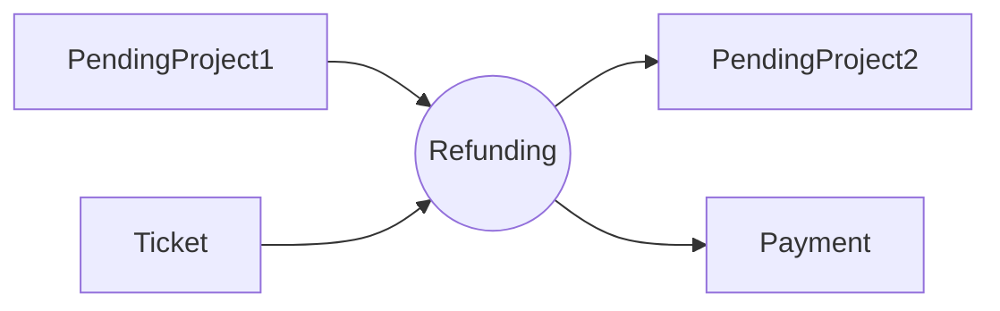

Changes:

- PendingProject: Some Stakoins are traded for the same number of Koins.

### Venture fund unlocking

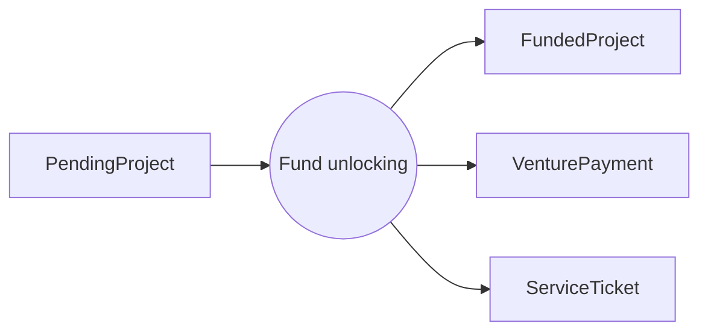

In this step, a part of the fund is given to venture based on the risk configuration. In addition, a part of Stakoins is given to the ErgoWell service for free, as fee. These Stakoins cannot be unstaked and are only used to receive interests and final rewards.

### Unstaking

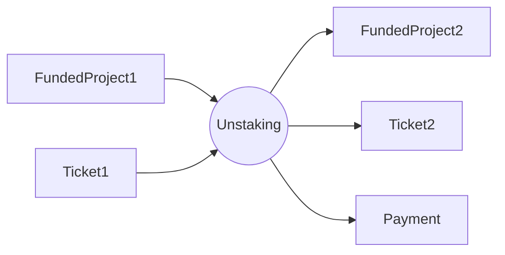

Changes:

- FundedProject: Some Stakoins are traded for the same number of Koins.

### Ticket charging

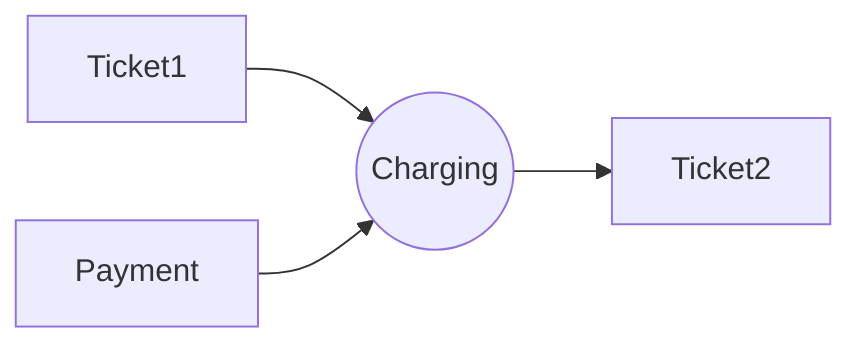

Changes:

- Ticket: The ERG value of box is increased.

Every ticket is charged when someone stakes Koins and receives the ticket. This charge is used to pay fees of the transactions. If the charge is emptied (e.g. as a result of too many unstaking transactions) it should be charged again so that this ticket can be used in new transactions.

### Interest distribution

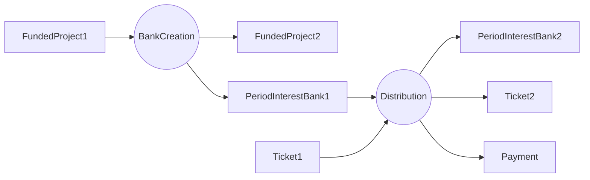

Changes:

- FundedProject: A share equal to the total payment of a period is removed from total interest.
- PeriodInterestBank: In each cycle, the payment of a specific ticket is removed.
- Ticket: `lastPaymentPeriodNumber` is increased by one.

### Profit box creation and filling

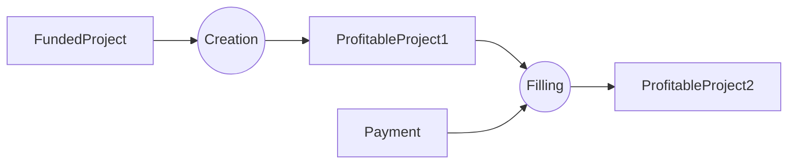

Changes:

- ProfitableProject: The profit is injected to the box. In addition, `isVentureSuccessful` may be changed to true.

### Final repayment

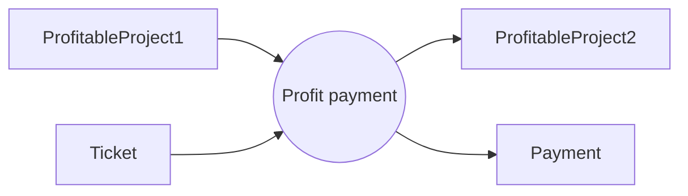

Changes:

- ProfitableProject: The profit of a specific ticket is removed.

### Collateral refunding (in case of a successful venture)

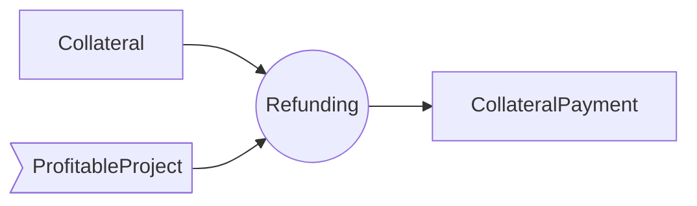

### Collateral unlocking (in case of a failed venture)

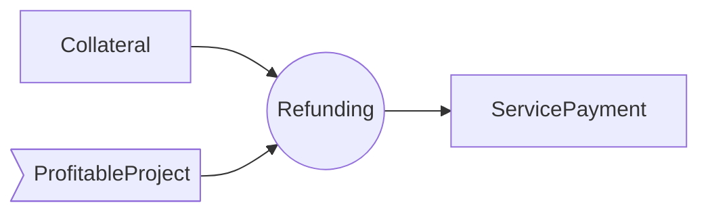

As you can see, in case of a failed venture, the collateral is sent to ErgeWell service address and then distributed by ErgoWell manually.

### Project redeeming

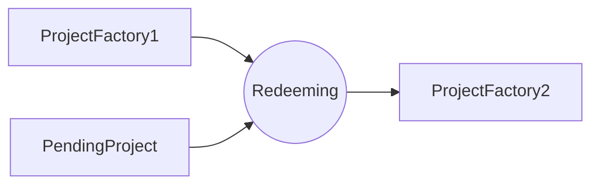

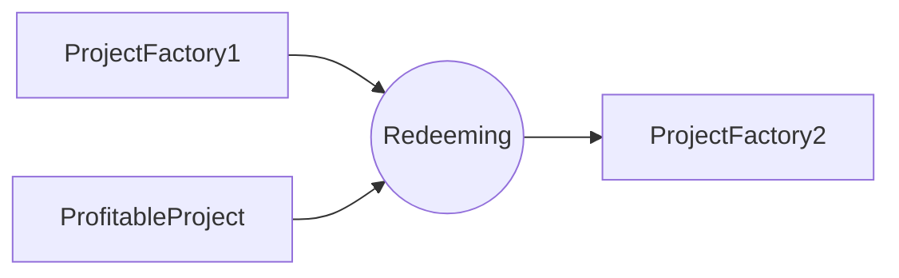

Changes:

- ProjectFactory: One of the licenses is redeemed.

## Fees

_Note: You can skip this section if you are not interested in technical details of ErgoWell._

The fees of the transactions are either payed by venture or investors. The following table shows who pays the fees:

| Transaction                     | Payer    |
| ------------------------------- | -------- |
| Project creation                | Venture  |
| Crowdfunding                    | Investor |
| Project owner refunding         | Venture  |
| Stakeholder refunding           | Investor |
| Venture fund unlocking          | Venture  |
| Ticket charging                 | Investor |
| Unstaking                       | Investor |
| Interest distribution           | Investor |
| Profit box creation and filling | Venture  |
| Final repayment                 | Investor |
| Project redeeming               | Venture  |

Venture fees are saved and flowed through TokenlessPendingProject, PendingProject, FundedProject and ProfitProject boxes. Investors fees are saved in Ticket box and can be charged if needed.
